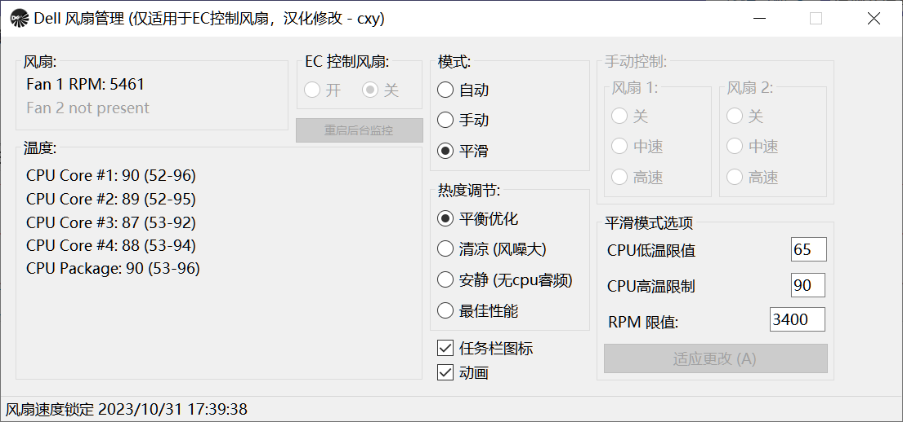

# 戴尔DELL笔电风扇速度控制

**注意：[此程序可能不适用于控制DELL笔电Intel 11代及以上BIOS系统](https://github.com/AaronKelley/DellFanManagement/issues/14)**

此程序除了对原作者程序的汉化以外，作了一些精简，
并特别改进"平滑"模式下，在设定温度范围内自动调节风扇速度，尽可能避免笔电常时间工作在不必要的高风速，高噪音中。

原始”平滑"模式下调节风扇原理：风扇速度只有在CPU温度（包括GPU，下面不再作特别说明)全部低于设置的上，下限，并且当前风扇速度
低于设置的限值时，风扇速度被锁定在RPM限值下，此后，如果工作负荷有增量时，不至于风噪突然增高。参看(https://web.archive.org/web/20220125130519fw_/http://forum.notebookreview.com/threads/dellfanmanagement-dellfankeepalive-%E2%80%93-tools-for-managing-the-fan-speed-in-dell-laptops.833340/）

改进"平滑"模式可以更智能地调节风速（在设定的温度范围内)，减少噪音: 

一个经常发生的故事是，如果笔电经常工作在某个特殊的温度上，下限范围内（比如65到90度)，
按DELL SMBIOS自动调节，只有关闭，中速，高速三种模式，此时，笔电CPU温度在75度附近很可能风扇就自动被拉到高速，
并使CPU温度维持在75度附近，虽然温度降了，但高速的噪音无法忍受？
那么，能不能这个时候能适当降低风扇速度，但又保持一个较高的温度上限90度(不至于到100度)？

**请往下看**

如果你不介意的CPU温度可以更高点，但风扇速度降低点，噪音少一点，
这个修改后的程序  DellFanMan.rar (2.15 MB, 下载次数: 0) 就比较适合你（解压运行DellFanManagement.exe)。
如果无法运行，请下载安装.NET Framework 5.0    dotnet-runtime-5.0.0-win-x64.exe (25.32 MB, 下载次数: 0) （或者直接微软网站下载安装）

举例：（见下图）
我的DELL latitude 7490中速RPM是3400，高速RPM是近7000 (可以通过”手动"模式，关闭EC, 调节中，高速得知）
现在我选择”平滑“模式， 并把CPU低温限制在65，高温限制在90，
RPM限值在中速RPM 3400，在多数高于65度并低于等于90度的场景模式下，风扇可以维持在中速（几乎很小噪音）
原理是，当温度检测在你设置的65到90度范围内，但风速高于RPM限值 3400，程序就自动试着将风扇降到中速。

此程序只在我的笔电上试运行，效果还可以, 感兴趣的朋友有类似需求的，想在90度或以下工作环境中保持低噪音的，可以试一下此程序，
设置方法参考上述， 温度范围可以差不多就设在65-90，RPM限值通过检测中速RPM值设定 (比如你的笔电中速RPM可能是2400)

**关于”平滑“模式下的设置和更多的案例说明：**
1. 注意不要将温度范围设置的太靠近，也不将温度上限设置高于95度（你懂的）

2. 你的工作环境需要经常保持在高负荷，比如你玩3D游戏，CPU温度保持很高常常在高速风扇时也有85度以上，就不得不常期开启高速风扇，此时，RPM限值可以往高速RPM调节（甚至8000，9000都可以），这样，程序就不会总是尝试去降速，然后又增速，反复切换。

3. 高负荷工作在90度边缘十分频繁（时常超越90度），“平滑”模式下，自动调节反复尝试降低风速，导致风速忽高忽低。此时，可以试着合并选择”热度调节“ > "安静” , 原理是关闭了睿频, 牺牲了一定的性能，使CPU温度不至于超过90度，风扇保持中速。

4. ... 没有了，等待发现惊人的bug !哈哈

**关于“手动”模式**
使用场景仅限于你笃定你的工作负荷恒定，比如，对应在50度附近 - 可关闭风扇，70度附近 - 中速，90度附近 - 高速

最后，如果“手动”和“平滑”模式的选项处于失效不可设置，大概率可能是驱动程序签名问题，需要失效。
在控制台运行命令：bcdedit.exe -set TESTSIGNING ON

**使用此程序自担风险！Enjoy it !**

Below is the readme from native creator

# DellFanManagement
A suite of tools for managing the fans in many Dell laptops.

See this NotebookReview thread for information about the tools contained in this project.
[DellFanManagement & DellFanKeepAlive – Tools for managing the fan speed in Dell laptops _ NotebookReview](https://web.archive.org/web/20220125130519fw_/http://forum.notebookreview.com/threads/dellfanmanagement-dellfankeepalive-%E2%80%93-tools-for-managing-the-fan-speed-in-dell-laptops.833340/)
