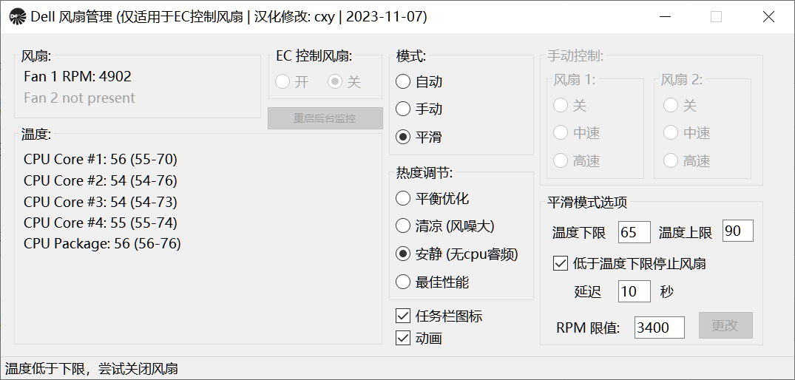

# 戴尔DELL笔电风扇速度控制

**注意：[此程序可能不适用于控制DELL笔电Intel 11代及以上BIOS系统](https://github.com/AaronKelley/DellFanManagement/issues/14)**

此程序除了对原作者程序的汉化以外，作了一些精简，
并特别改进"平滑"模式下，在设定温度范围内自动调节风扇速度，尽可能避免笔电常时间工作在不必要的高风速，高噪音中。

更多信息和使用，参考[WIKI](https://github.com/simonchen/DellFanManagement/wiki)

**使用此程序自担风险！Enjoy it !**

Below is the readme from native creator

# DellFanManagement
A suite of tools for managing the fans in many Dell laptops.

See this NotebookReview thread for information about the tools contained in this project.
[DellFanManagement & DellFanKeepAlive – Tools for managing the fan speed in Dell laptops _ NotebookReview](https://web.archive.org/web/20220125130519fw_/http://forum.notebookreview.com/threads/dellfanmanagement-dellfankeepalive-%E2%80%93-tools-for-managing-the-fan-speed-in-dell-laptops.833340/)
